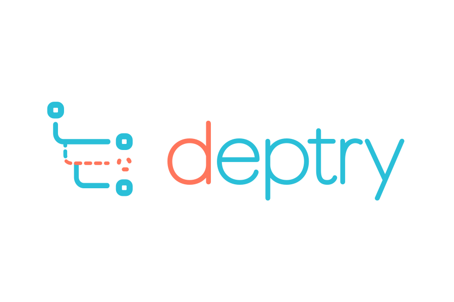

<style>
  .md-typeset h1 {
    display: none;
  }
</style>

<figure markdown>
  { width="460" }
</figure>

---

[](https://pypi.org/project/deptry/)
[](https://github.com/fpgmaas/deptry/actions/workflows/main.yml)
[](https://pypi.org/project/deptry/)
[](https://codecov.io/gh/fpgmaas/deptry)
[](https://pypistats.org/packages/deptry)
[](https://img.shields.io/github/license/fpgmaas/deptry)

_deptry_ is a command line tool to check for issues with dependencies in a Python project, such as unused or missing
dependencies. It supports projects
using [Poetry](https://python-poetry.org/), [pip](https://pip.pypa.io/), [PDM](https://pdm-project.org/), [uv](https://docs.astral.sh/uv/),
and more generally any project supporting [PEP 621](https://peps.python.org/pep-0621/) specification.

Dependency issues are detected by scanning for imported modules within all Python files in a directory and its subdirectories, and comparing those to the dependencies listed in the project's requirements.

---

## Quickstart

### Installation

To add _deptry_ to your project, run one of the following commands:

```shell
# Install with poetry
poetry add --group dev deptry

# Install with pip
pip install deptry
```

!!! important

    When using pip to install _deptry_, make sure you install it within the virtual environment of your project. Installing _deptry_ globally will not work, since it needs to have access to the metadata of the packages in the virtual environment.

### Prerequisites

_deptry_ should be run within the root directory of the project to be scanned, and the project should be running in its own dedicated virtual environment.

### Usage

To scan your project for dependency issues, run

```shell
deptry .
```

Example output could look as follows:

```console
Scanning 2 files...

foo/bar.py:1:0: DEP004 'numpy' imported but declared as a dev dependency
foo/bar.py:2:0: DEP001 'matplotlib' imported but missing from the dependency definitions
pyproject.toml: DEP002 'pandas' defined as a dependency but not used in the codebase
Found 3 dependency issues.
```

### Configuration

_deptry_ can be configured by using additional command line arguments, or
by adding a `[tool.deptry]` section in `pyproject.toml`. For more information, see [Usage and Configuration](./usage.md)
